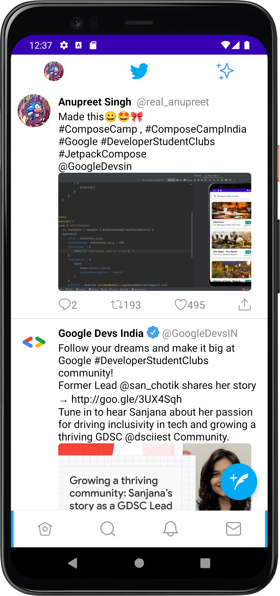
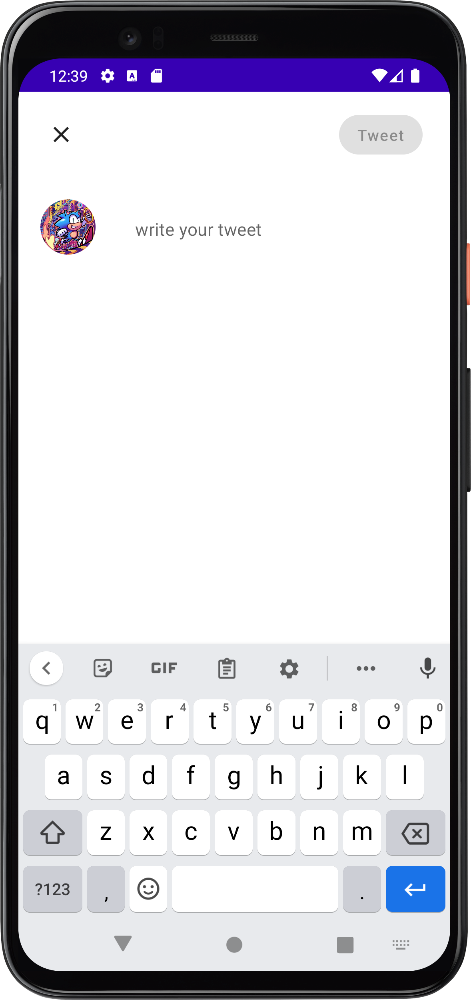
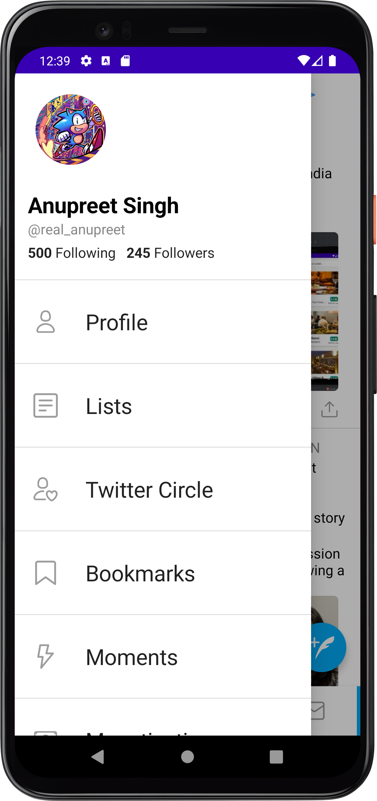
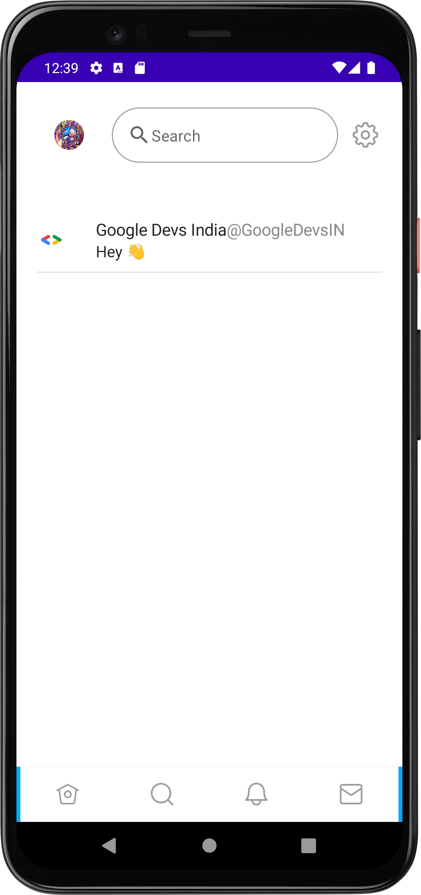
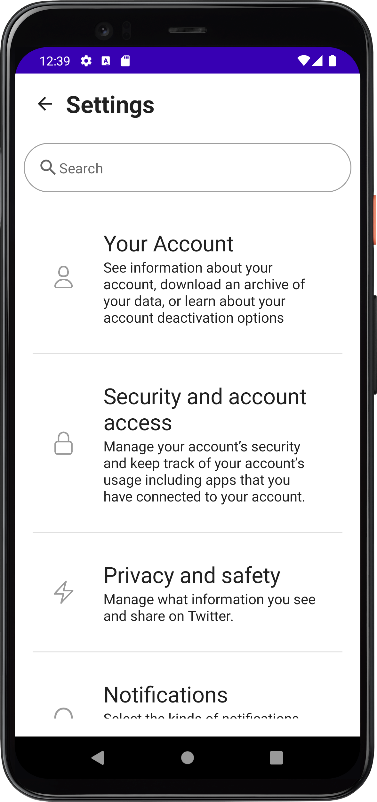
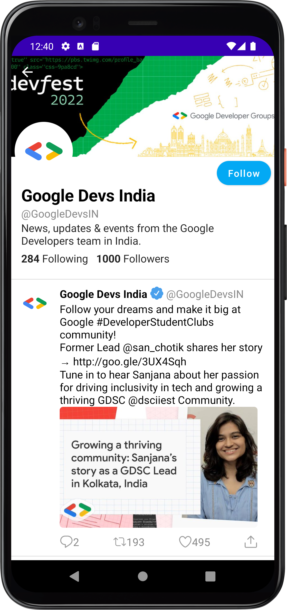
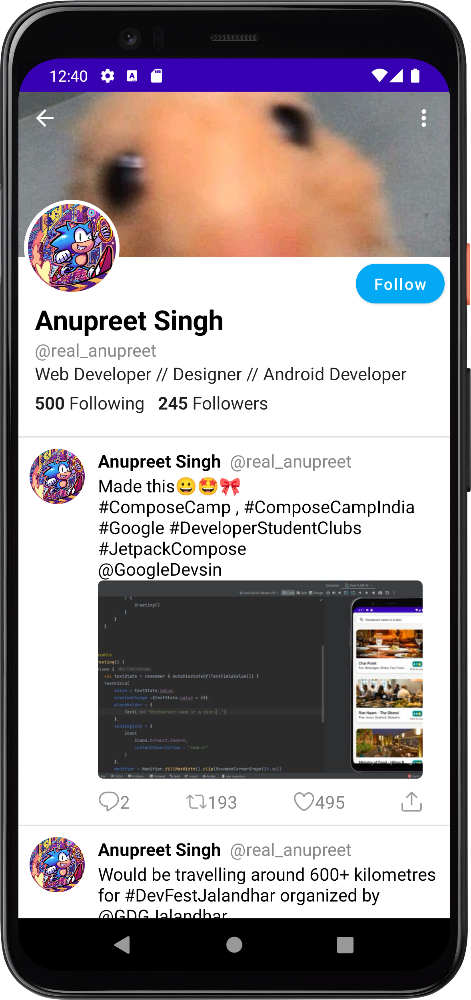
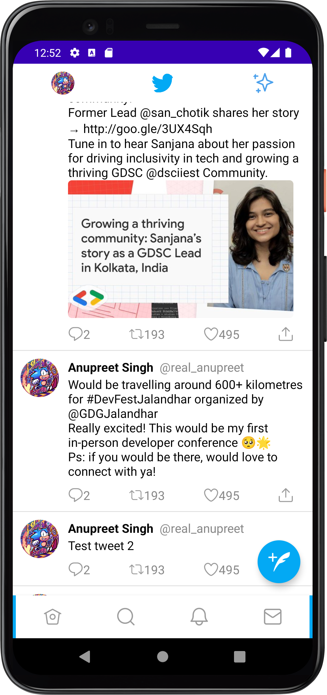

# TwitterClone
Twitter UI clone made with jetpack compose and kotlin

## Problem Statement

[Clone App]  To recreate four or more screens of any play store application (with >=50000 downloads) using Jetpack Compose.

## Proposed Solution with screenshots

Proposed solution is to build a twitter clone using jetpack compose with a motto of building the ui in a easy to manage way, it makes the use of different layouting techniques available in compose and provides the functionality to the user to add their tweets and use the navigation implemented with state managed throughout the view model.

|   |   |   |   |
|---|---|---|---|
|   |   |   |   | 

## Functionality & Concepts used

- **Functionality implemented:** The app implements the basic concepts which are implemented in the official twitter app which requires a custom scaffold, ability for people to add their own tweets to the app, a drawer layout built with a similar design, the bottom navigation and profile navigation, the app uses reusable components for easy maintainability and architecture

- **Concepts which were implemented:** Layouts, modifiers, lazy column, drawer layout, constraint layout, view model, state, compose navigation, material design.

## Application Link & Future Scope

- **Application Link:** [link](https://drive.google.com/drive/folders/1Rl1eBvYInPkLeFsMaVmJm_pm1OtqF_Qg?usp=sharing)

- **Future Scope:** The future scope of the application is to add more functionality in terms of adding to the app the functionality of persistent and real time user data along .